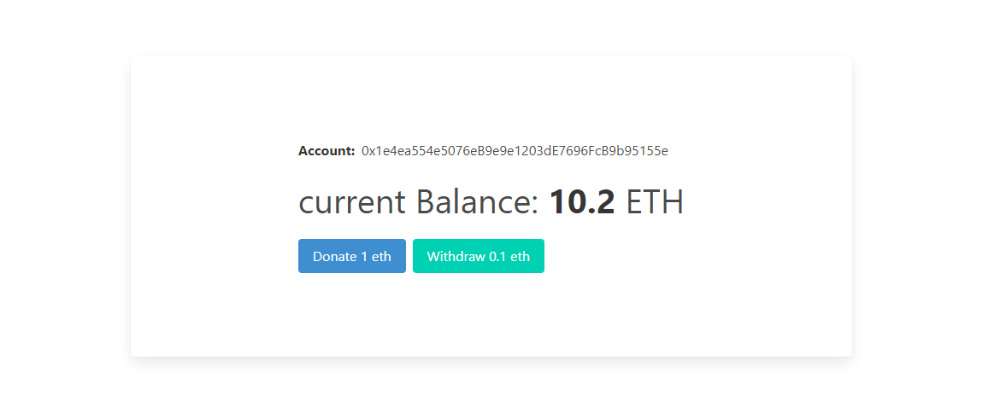
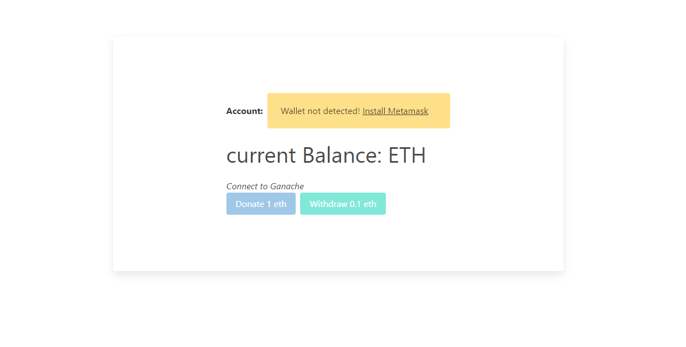
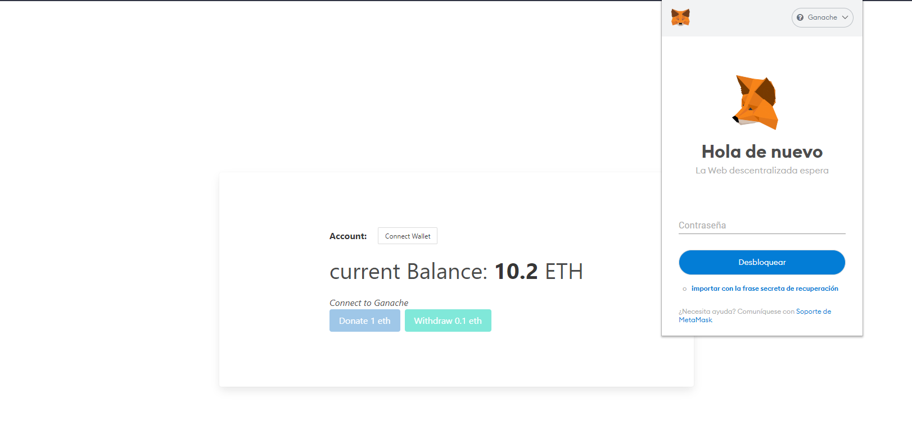

# Getting Started

### Install Ganache testing blockchain and Metamask wallet

In the project directory, you can run:

### To compile and execute the smart contracts to Ganache:

#### `truffle deploy`
#### `truffle migrate`

### Run the project in the browser

#### `npm start`
Runs the app in the development mode

## App overview

*********************************************************************

*********************************************************************

*********************************************************************

